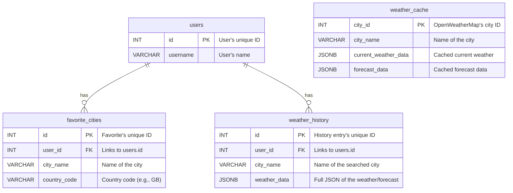

# Database Schema

This document outlines the database schema for the Weather Dashboard application. The diagram below illustrates the tables and their relationships.

```mermaid
erDiagram
    users {
        INT id PK "User's unique ID"
        VARCHAR username "User's name"
    }

    favorite_cities {
        INT id PK "Favorite's unique ID"
        INT user_id FK "Links to users.id"
        VARCHAR city_name "Name of the city"
        VARCHAR country_code "Country code (e.g., GB)"
    }

    weather_history {
        INT id PK "History entry's unique ID"
        INT user_id FK "Links to users.id"
        VARCHAR city_name "Name of the searched city"
        JSONB weather_data "Full JSON of the weather/forecast"
    }

    weather_cache {
        INT city_id PK "OpenWeatherMap's city ID"
        VARCHAR city_name "Name of the city"
        JSONB current_weather_data "Cached current weather"
        JSONB forecast_data "Cached forecast data"
    }

    users ||--o{ favorite_cities : "has"
    users ||--o{ weather_history : "has"
```

